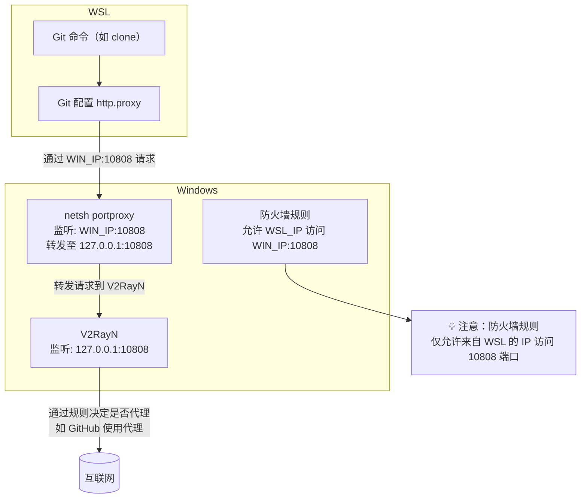

## Windows中配置

```shell
//配置
git config --global http.proxy http://127.0.0.1:10808 
git config --global https.proxy http://127.0.0.1:10808
//查看
git config --list
//删除
git config --global --unset http.proxy
git config --global --unset https.proxy
```

## WSL2中配置（基于规则代理）

由于 WSL2 基于 Hyper-V 架构，Linux 子系统与 Windows 网络隔离、视作两台独立主机，默认无法直接访问 Windows 本地代理。再加上 IP 地址动态变化及不支持 Socks5，因此需通过端口转发将 Windows 的 HTTP 代理暴露给 WSL2 使用，从而实现稳定的代理通信。



---

### Windows端配置脚本

需要先把`iphlpsvc`改为自动，`netsh`规则依赖此服务，`win+r`输入`services.msc`，找到`iphlpsvc`设置为自动


保存为`wsl-proxy.ps1`：

```powershell
# Ensure IP Helper service is running
Set-Service -Name iphlpsvc -StartupType Automatic
Start-Service -Name iphlpsvc -ErrorAction SilentlyContinue

# Check if V2RayN is listening on 127.0.0.1:10808
$listener = Get-NetTCPConnection -LocalAddress 127.0.0.1 -LocalPort 10808 -State Listen -ErrorAction SilentlyContinue

if (-not $listener) {
    Write-Host "Warning: V2RayN is not running or not listening on 127.0.0.1:10808. It is recommended to start V2RayN before running this script." -ForegroundColor Red
    pause
    exit 1
}

# Get WSL IP
$wslIp = wsl hostname -I | ForEach-Object { $_.Trim() } | Select-String -Pattern "^(\d+\.){3}\d+" | ForEach-Object { $_.ToString() }

# Get Windows IP (vEthernet for WSL)
$winIp = Get-NetIPAddress -InterfaceAlias "vEthernet (WSL)" -AddressFamily IPv4 |
    Select-Object -ExpandProperty IPAddress -First 1

# Validate IPs
if (-not $wslIp -or -not $winIp) {
    Write-Host "Failed to retrieve WSL or Windows IP." -ForegroundColor Red
    exit 1
}

Write-Host "WSL IP: ${wslIp}" -ForegroundColor Cyan
Write-Host "Windows IP: ${winIp}" -ForegroundColor Cyan

# Port forwarding settings
$listenPort = 10808
$connectPort = 10808
$ruleName = "Allow WSL Proxy ${listenPort}"

# Remove all portproxy rules listening on this port (regardless of IP)
$rulesToDelete = netsh interface portproxy show v4tov4 | `
    Select-String "^\s*(\d{1,3}\.){3}\d{1,3}\s+$listenPort\s+" | ForEach-Object {
        ($_ -split '\s+') | Where-Object { $_ -match '(\d{1,3}\.){3}\d{1,3}' }
    }

foreach ($ip in $rulesToDelete) {
    netsh interface portproxy delete v4tov4 listenport=$listenPort listenaddress=$ip >$null 2>&1
    Write-Host "Deleted old portproxy rule on ${ip}:${listenPort}" -ForegroundColor DarkGray
}

# Apply new portproxy rule
netsh interface portproxy add v4tov4 listenport=$listenPort listenaddress=$winIp connectport=$connectPort connectaddress=127.0.0.1

Write-Host "Port forwarding ${winIp}:${listenPort} -> 127.0.0.1:${connectPort}" -ForegroundColor Green

# Reset existing firewall rule if exists
$existingRule = Get-NetFirewallRule -DisplayName $ruleName -ErrorAction SilentlyContinue
if ($existingRule) {
    Remove-NetFirewallRule -DisplayName $ruleName
    Write-Host "Removed existing firewall rule: ${ruleName}" -ForegroundColor DarkGray
}

# Add new firewall rule
New-NetFirewallRule -DisplayName $ruleName -Direction Inbound -LocalPort $listenPort -Protocol TCP -Action Allow -RemoteAddress $wslIp

Write-Host "Firewall rule created for ${wslIp} on port ${listenPort}" -ForegroundColor Yellow
```

### 快捷启动脚本

另建一个 `start-proxy.bat`：

```bat
@echo off
title Setup WSL Git Proxy

:: Run the PowerShell script with admin privileges
powershell -NoProfile -ExecutionPolicy Bypass -File "%~dp0wsl-proxy.ps1"

pause
```
> `wsl-proxy.ps1`和`start-proxy.bat`需要在同一目录下并使用管理员运行<br>
> ⚠️ **请确保先启动 V2RayN，再运行 PowerShell 脚本，否则端口可能被占用，导致代理失败。**

---

### WSL端配置脚本

在 WSL 中添加到 `.bashrc` 文件：

```bash
function test_proxy() {
  local proxy=$1
  curl -s -x http://$proxy https://github.com -o /dev/null --connect-timeout 3
  return $?
}

function gitproxy() {
  local PORT=10808
  local WIN_IP=$(ip route | grep default | awk '{print $3}')
  local PROXY="$WIN_IP:$PORT"

  echo "Testing proxy: http://$PROXY ..."
  if test_proxy $PROXY; then
    git config --global http.proxy "http://$PROXY"
    git config --global https.proxy "http://$PROXY"
    echo "Git proxy enabled: http://$PROXY"
  else
    echo "Failed to connect to http://$PROXY. Make sure V2RayN is running and port forwarding is enabled."
  fi
}

function gitnoproxy() {
  git config --global --unset http.proxy
  git config --global --unset https.proxy
  echo "Git proxy disabled"
}
```

```bash
source ~/.bashrc
```

这样打开终端后可直接使用：

```bash
gitproxy    # 开启代理
gitnoproxy  # 关闭代理
```

---

### 检查建议

遇到代理失败，检查以下几点：

- ✅ V2RayN 是否已运行并监听 127.0.0.1:10808
  ```powershell
  netstat -ano | findstr 10808
  ```
- ✅ 是否已设置 portproxy 规则
  ```powershell
  netsh interface portproxy show all
  ```
- ✅ 防火墙是否放行转发端口
  ```powershell
  netsh advfirewall firewall show rule name="Allow WSL Proxy 10808"
  ```
- ✅ WSL 是否能访问 Windows IP
  ```bash
  curl -x http://<Windows_IP>:10808 https://www.google.com
  ```

---

## 代理协议说明

**为什么 https.proxy 也是用 `http://127.0.0.1:10808`？**

因为：
- `http://...` 表示代理协议是 HTTP
- Git 通过 HTTP 协议与本地代理通信（ Git不支持通过 HTTPS 协议去连接代理服务器，大部分代理软件本身也不支持接收 `https://` 的代理连接）
- 然后由代理软件建立实际的 HTTPS 连接

> ✅ 即使访问 HTTPS 网站，也需要写成 `http://...`，不能写 `https://...`，否则 Git 会报错。
